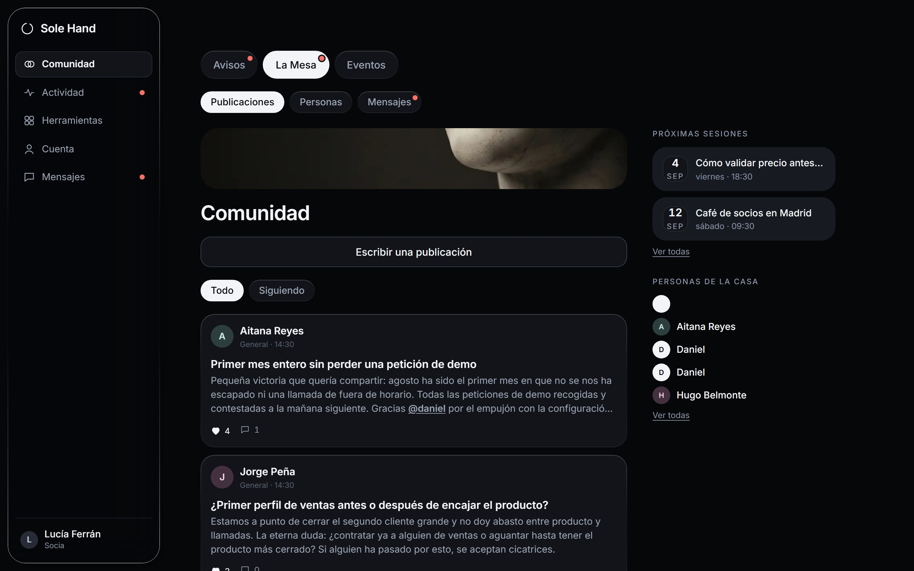
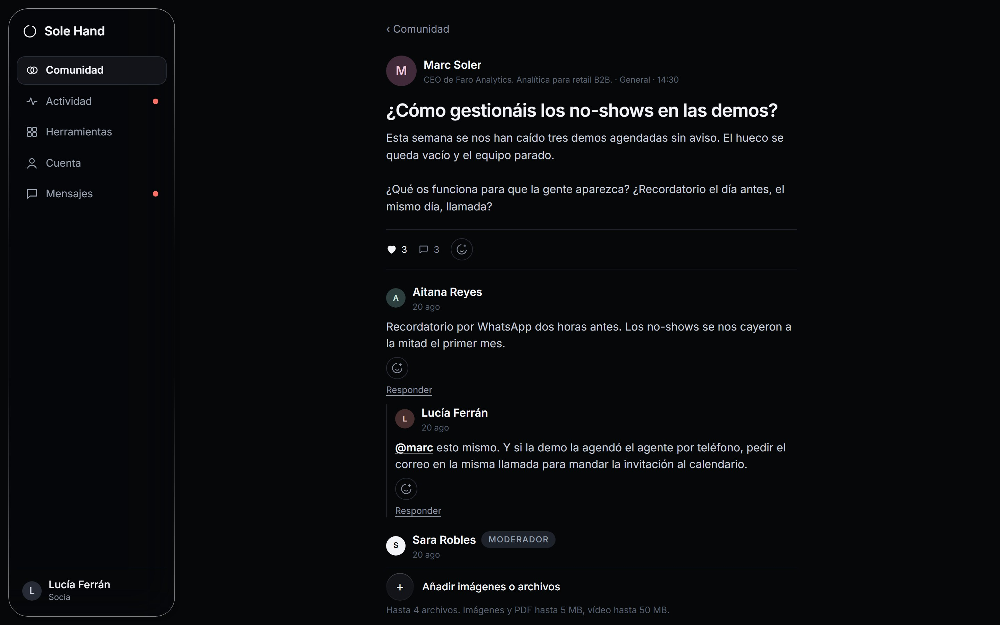
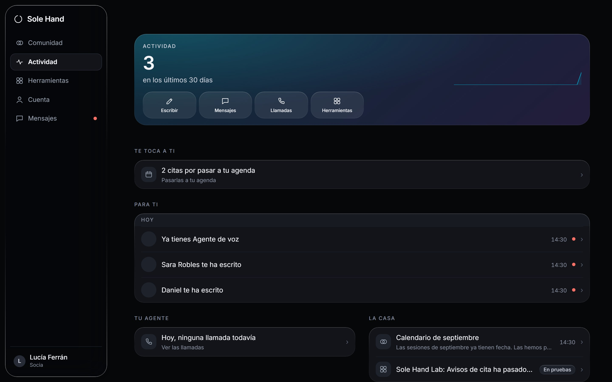
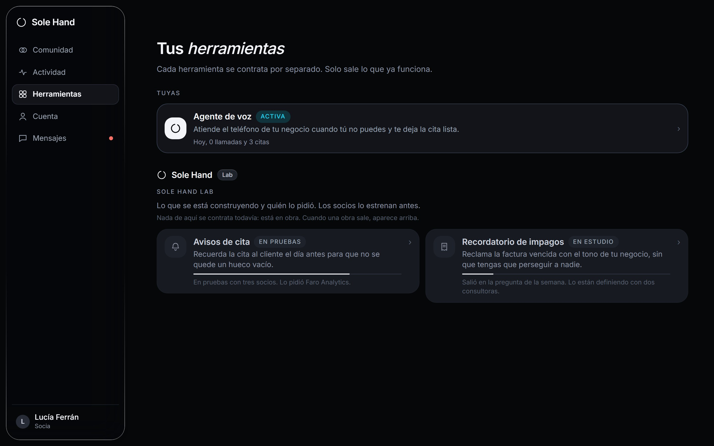
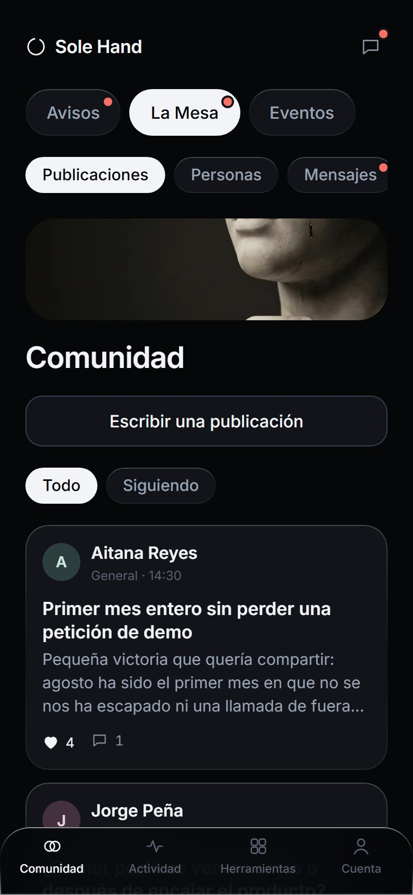

  

<h3 align="center">Tú pones el problema. Nosotros, el producto.</h3>

  <a href="https://solehand.com">solehand.com</a> · español / english

---

Sole Hand es una agencia de inteligencia artificial para negocios en España, construida con una regla simple: **no se vende nada que no esté ya funcionando en un negocio real**.

Este repositorio es el escaparate público del proyecto: qué se está construyendo, en qué estado está y cómo está hecho por dentro, a nivel de arquitectura. El código de producción vive en repositorios privados.

## Qué hay construido

### El agente de voz

El primer producto. Un asistente que atiende el teléfono entrante de un negocio cuando su equipo no puede: fuera de horario, cuando comunica o cuando entran varias llamadas a la vez.

| Hace | No hace |
| --- | --- |
| Contesta en castellano, sin dejar sonar el teléfono | No decide por el negocio |
| Recoge la cita completa: nombre, motivo y hora preferida | No escribe directamente en la agenda |
| Se presenta como asistente virtual nada más descolgar | No se hace pasar por una persona |
| Deja un resumen claro de cada llamada | No obliga a escuchar grabaciones |

La frontera está puesta a propósito: el agente recoge y entrega, y la última palabra siempre es de una persona. De ahí el nombre del proyecto.

### La comunidad

Un grupo privado de dueños de negocio donde cada uno pone sobre la mesa lo que le hace perder tiempo o dinero. Cada dos semanas hay una sesión en directo de 90 minutos: un negocio cuenta su caso y el resto aporta. Dentro se ven las soluciones funcionando antes que nadie.

Empezó en WhatsApp, que era lo que había a mano en agosto para no hacer esperar a nadie, y desde entonces tiene casa propia: la plataforma que se cuenta más abajo. 19 € al mes, sin permanencia. El alta es directa: se registra uno mismo y entra.

### La plataforma

La casa de los socios. Empezó como una comunidad prestada en WhatsApp y hoy es una aplicación propia donde vive todo: la conversación, las sesiones, las herramientas que cada negocio tiene contratadas y la relación con el equipo.

**La comunidad, por dentro.** La conversación está repartida en tres canales —los avisos del equipo, la mesa donde se habla y los eventos— y dentro de cada uno hay publicaciones, personas y mensajes directos. Se puede publicar con imágenes y archivos, responder en hilos de hasta tres niveles, reaccionar y seguir a alguien. Lo que en un grupo de WhatsApp se pierde a los dos días, aquí se queda donde se puede encontrar.

| Un hilo abierto | La portada de cada socio |
| --- | --- |
|  |  |

**La portada** no es un panel de métricas: es lo que hay que atender hoy. Arriba, una cifra que resume el mes; debajo, lo que está esperando a esa persona en concreto. Cada socio ve su propia actividad y solo la suya.

**Las herramientas** se contratan una a una y cada negocio ve las que tiene. Junto a ellas está el laboratorio: lo que se está construyendo ahora mismo, en qué fase va y quién lo pidió. Es la regla del proyecto puesta a la vista, porque cada herramienta sale del problema que alguien contó en la mesa.

Está pensada para el teléfono, que es desde donde se usa de verdad, y se guarda en la pantalla de inicio como una aplicación más sin pasar por ninguna tienda.

Por dentro es un backend propio en un servidor europeo: cada dato está protegido por políticas a nivel de fila, de modo que la separación entre lo que puede ver un socio y lo que no la decide la base de datos y no la pantalla. El consentimiento de las condiciones se guarda con su versión íntegra, la fecha y la dirección desde la que se aceptó, y una cuenta se puede borrar de verdad: se retira todo lo personal y lo que esa persona escribió en la comunidad se queda sin su nombre, para no dejar a medias las conversaciones de los demás.

### La web

Bilingüe español / inglés: cada idioma tiene su URL propia, generada en build con su título, sus metadatos y sus datos estructurados, y las dos versiones se declaran mutuamente con hreflang. Diseño propio sobre una dirección de arte de mármol y cromo, con animación medida y una regla de copy que se aplica a todo el proyecto: lo tiene que entender un niño de 5 años y un abuelo de 80.

| Móvil | Inglés | La página /hablamos |
| --- | --- | --- |
|  |  |  |

## Estado del proyecto

Actualizado a 24 de agosto de 2026.

| Módulo | Estado | Progreso |
| --- | --- | --- |
| Web pública bilingüe | En producción en solehand.com | `█████████░` 92 % |
| Plataforma de socios | En producción, con alta abierta | `████████░░` 80 % |
| Servicio de captación de leads | En producción | `█████████░` 88 % |
| Comunidad | Abierta, se entra sin esperar | `████████░░` 80 % |
| Agente de voz v1 | En piloto | `██████░░░░` 55 % |
| Contenido y marca en redes | En curso | `██████░░░░` 65 % |
| Portal de afiliados | En producción, primera versión | `█████░░░░░` 50 % |
| Cobro con tarjeta | Lo siguiente | `█░░░░░░░░░` 10 % |
| Confirmación de citas | En diseño | `█░░░░░░░░░` 10 % |
| Recursos gratuitos | Carpeta abierta, primeros en preparación | `█░░░░░░░░░` 5 % |

La bitácora completa, con los hitos fechados, está en [docs/bitacora.md](docs/bitacora.md).

## Cómo está hecho

Resumen rápido; el detalle está en [docs/arquitectura.md](docs/arquitectura.md).

- **Frontend:** React 18 + Vite + TypeScript, Tailwind CSS 4 y GSAP para el movimiento. Sin router: la web es una pieza única con anclas, y en build se genera una URL propia por idioma con sus metadatos y su hreflang.
- **Plataforma:** React 18 + Vite + TypeScript, Tailwind CSS 4 y react-router, contra un backend propio autoalojado en Europa (PostgreSQL con políticas por fila, autenticación y funciones en el borde). Aplicación web instalable, con su propio service worker. Bilingüe como la web, y un sistema de diseño con contratos que se verifican solos en cada build: los contrastes se recalculan, los tamaños y los colores salen de una escala única y las capturas de las pantallas se revisan enteras antes de cada despliegue.
- **Leads:** servicio propio en Node, separado de la web, que recibe el formulario, avisa al equipo y responde al interesado. Sin plataformas de marketing por medio: los detalles del interesado viajan solo por el correo de la empresa.
- **Infraestructura:** contenedores Docker detrás de nginx en un VPS propio, con cabeceras de seguridad configuradas a mano y HTML sin caché para que los cambios se vean al instante.
- **Cumplimiento desde el diseño:** el agente se presenta como asistente virtual al descolgar, como exige el artículo 50 del Reglamento Europeo de IA, y está diseñado para que los datos se procesen en infraestructura europea. La web no usa cookies de rastreo.

## Dirección de arte

Toda la marca vive en un mismo mundo: mármol de Carrara, cromo y negro. El símbolo es un enso, un círculo abierto: la inteligencia artificial hace el trabajo y una mano humana, la última, decide. Las piezas para redes se componen con un sistema propio que garantiza que cada publicación sale del mismo molde.

## Recursos gratuitos

En [recursos/](recursos/) irán las guías, plantillas y pequeñas herramientas que el proyecto libere gratis. La regla es la de siempre: solo se publica lo que ya se ha usado de verdad por dentro. De momento la carpeta está recién abierta y lo dice tal cual.

## Contacto

El proyecto se puede ver funcionando en [solehand.com](https://solehand.com). Para hablar del proyecto, el formulario de [solehand.com/hablamos](https://solehand.com/hablamos).

---

© 2026 Daniel Brosed. Este repositorio es material de portfolio; el código de producción no es público.
