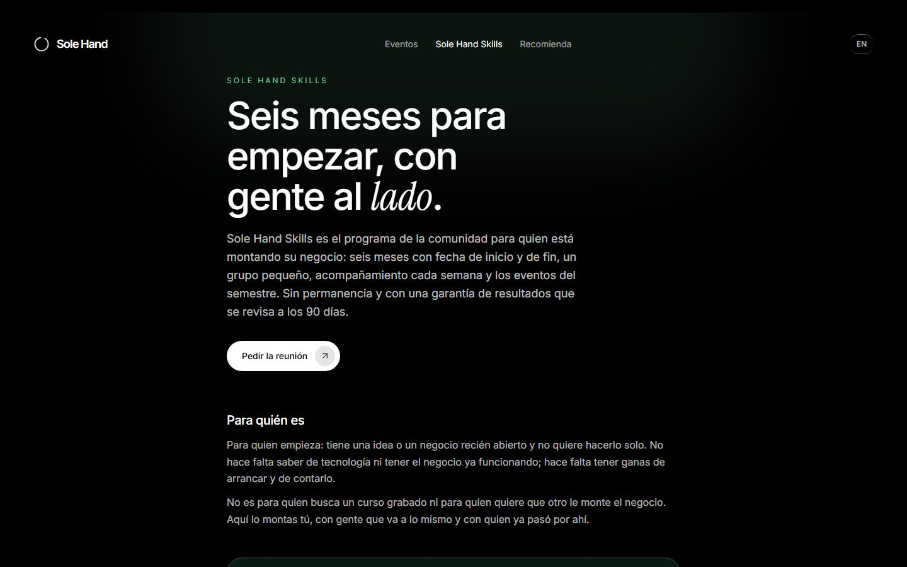

  

<h3 align="center">Emprender ya no se hace solo.</h3>

  <a href="https://solehand.com">solehand.com</a> · <a href="#español">español</a> / <a href="#english">english</a>

---

## Español

Sole Hand es una comunidad de emprendedores: gente que ya tiene un negocio y gente que quiere empezar. Nos vemos en persona, usamos herramientas de inteligencia artificial propias en la Sole Hand App y quien recomienda la comunidad cobra por ello.

Este repositorio es el escaparate público del proyecto: qué se está construyendo, en qué estado está y cómo está hecho por dentro, a nivel de arquitectura. El código de producción vive en repositorios privados. Aquí no hay precios: están en la web, que es donde se auditan.

### Qué hay construido

#### La comunidad

Quien lleva años con su negocio y quien está montando el primero, en el mismo sitio. La conversación vive en grupos de WhatsApp por sector; las quedadas van incluidas en todas las membresías; los eventos y retiros que se organizan llevan su ficha (cuándo, dónde, qué incluye, qué no y en qué membresías va incluida la entrada) y las plazas se reservan desde la app por orden de reserva.

#### Los eventos

Nos vemos en persona. Cada evento se publica desde un único fichero de contenido tipado: si a una ficha le falta la fecha, qué incluye, qué no incluye o las membresías que la incluyen, la web no compila. El viaje y los traslados nunca van incluidos, y las plazas nunca se sortean.

#### La Sole Hand App

La casa de las herramientas y de los eventos. Dentro viven las herramientas de inteligencia artificial propias, que nacen de los problemas que los socios ponen sobre la mesa y van dentro de la cuota; la reserva de plazas en los eventos; la cuenta de cada socio y, para quien recomienda, su portal de afiliado. Ninguna herramienta es el producto: la comunidad lo es.

| La portada de cada socio | Las herramientas y el laboratorio | En el móvil |
| --- | --- | --- |
|  |  |  |

Por dentro es un backend propio en un servidor europeo: cada dato está protegido por políticas a nivel de fila, de modo que la separación entre lo que puede ver un socio y lo que no la decide la base de datos y no la pantalla. Cada cobro genera su factura; el consentimiento de las condiciones se guarda con su versión íntegra, la fecha y la dirección desde la que se aceptó; y una cuenta se puede borrar de verdad.

#### Sole Hand Skills

El programa de seis meses para quien empieza: grupo pequeño, sesión de grupo semanal, mastermind y reunión a solas cada mes, las herramientas de la app y los eventos del semestre. Con fecha de inicio y de fin, sin permanencia y con una garantía de resultados que se revisa a los 90 días con un comité de socios y un founder.

#### Recomienda y cobra

Recomendar es gratis, no exige ser socio y se cobra solo por membresías que se pagan y se usan. Las reglas están escritas y a la vista, y hay un aviso claro: lo que se cobra depende de a quién se traiga y de que se quede.

#### La web

Trilingüe: español, inglés y una variante para México, cada una con su URL, sus metadatos y sus datos estructurados generados en build. Prerrenderizada entera para que los rastreadores que no ejecutan JavaScript la lean. Y con guardas que rompen el build si el copy contradice la marca, si un precio no cuadra con lo que cobra la app o si un color baja del contraste mínimo.

| Móvil | Inglés | La página /hablamos |
| --- | --- | --- |
|  |  |  |

### Estado del proyecto

Actualizado a 8 de septiembre de 2026.

| Módulo | Estado |
| --- | --- |
| Web pública trilingüe | Remodelada para la comunidad de emprendedores; pendiente de revisión legal antes de publicar |
| Sole Hand App | En producción; en migración: la conversación pasa a WhatsApp y entran los eventos, el programa y las comisiones por niveles |
| Comunidad | Abierta, con alta directa |
| Eventos | Fichas y reserva desde la app en construcción |
| Sole Hand Skills | Programa definido; el cobro se despliega con la app |
| Recomienda y cobra | Primera versión en producción; segundo nivel en construcción |
| Herramientas de IA | La primera (un asistente que contesta el teléfono) en piloto; catálogo vivo |
| Cobro con tarjeta y factura por cobro | En producción |

La bitácora completa, con los hitos fechados, está en [docs/bitacora.md](docs/bitacora.md).

### Cómo está hecho

Resumen rápido; el detalle está en [docs/arquitectura.md](docs/arquitectura.md).

- **Web:** React 18 + Vite + TypeScript, Tailwind CSS 4 y GSAP para el movimiento. Sin router: enrutado por expresiones regulares y una URL propia por idioma generada en build, con hreflang y sitemap. Prerrender con Playwright y cuatro auditorías en cada build (copy, precios, contraste y locale).
- **Sole Hand App:** React 18 + Vite + TypeScript, Tailwind CSS 4 y react-router, contra un backend propio autoalojado en Europa (PostgreSQL con políticas por fila, autenticación, funciones en el borde). Aplicación web instalable. Cobro con tarjeta y factura automática por cada cobro.
- **Leads:** servicio propio en Node, separado de la web, que recibe el formulario, avisa al equipo y responde al interesado.
- **Infraestructura:** contenedores Docker detrás de nginx en un VPS propio, con cabeceras de seguridad configuradas a mano y HTML sin caché.
- **Cumplimiento desde el diseño:** las herramientas se presentan como asistentes, como exige el artículo 50 del Reglamento Europeo de IA; los datos se procesan en infraestructura europea; la web no usa cookies de rastreo; 14 días de desistimiento y baja en un clic.

### Dirección de arte

Negro, blanco y una rampa de seis verdes: un tono, varios valores. El símbolo es un enso, un círculo abierto: la inteligencia artificial hace el trabajo y una mano humana, la última, decide. La fotografía de mármol de la primera etapa sigue en la web hasta que entren las fotos reales de los eventos.

### Recursos gratuitos

En [recursos/](recursos/) irán las guías, plantillas y pequeñas herramientas que el proyecto libere gratis. La regla es la de siempre: solo se publica lo que ya se ha usado de verdad por dentro.

### Contacto

El proyecto se puede ver funcionando en [solehand.com](https://solehand.com). Para hablar del proyecto, el formulario de [solehand.com/hablamos](https://solehand.com/hablamos).

---

## English

Sole Hand is a community of entrepreneurs: people who already run a business and people who want to start one. We meet in person, we use our own artificial intelligence tools inside the Sole Hand App, and whoever recommends the community gets paid for it.

This repository is the project's public showcase: what is being built, where it stands and how it is made, at architecture level. Production code lives in private repositories. There are no prices here: they live on the website, where they are audited.

### What is built

- **The community.** People with a running business and people building their first one, in the same place. The conversation lives in WhatsApp groups by sector; meetups are included in every membership; events and retreats come with their own card (when, where, what is included, what is not, and which memberships include the ticket) and seats are booked from the app on a first-come basis.
- **The events.** We meet in person. Every event is published from a single typed content file: if a card is missing its date, what is included, what is not or the memberships that include it, the site does not compile. Travel is never included and seats are never raffled.
- **The Sole Hand App.** The home of the tools and the events: our own AI tools (born from the problems members put on the table and included in the fee), event bookings, each member's account and, for those who recommend, their affiliate portal. No tool is the product: the community is.
- **Sole Hand Skills.** The six-month programme for people starting out: a small group, a weekly session, a monthly mastermind and one-to-one, the app's tools and the semester's events. Start and end dates, no lock-in, and a results guarantee reviewed at 90 days by a committee of members and a founder.
- **Recommend and earn.** Recommending is free, does not require membership and pays only on memberships that are paid for and used. The rules are written and visible, with a plain warning: what you earn depends on who you bring and on whether they stay.
- **The website.** Spanish, English and a Mexican variant, each with its own URL, metadata and structured data generated at build time. Fully prerendered so crawlers that do not run JavaScript can read it, with build guards that fail if the copy contradicts the brand, a price does not match what the app charges, or a colour drops below the minimum contrast.

### How it is made

- **Website:** React 18 + Vite + TypeScript, Tailwind CSS 4 and GSAP. No router library: regex routing and one URL per language generated at build, with hreflang and sitemap. Playwright prerender and four audits on every build (copy, prices, contrast and locale).
- **Sole Hand App:** React 18 + Vite + TypeScript, Tailwind CSS 4 and react-router, against a self-hosted backend in Europe (PostgreSQL with row-level policies, auth, edge functions). Installable web app. Card payments with an automatic invoice per charge.
- **Leads:** a small Node service, separate from the site, that receives the form, alerts the team and replies to the person.
- **Infrastructure:** Docker containers behind nginx on our own VPS, hand-configured security headers and uncached HTML.
- **Compliance by design:** the tools introduce themselves as assistants, as Article 50 of the EU AI Act requires; data is processed on European infrastructure; the site uses no tracking cookies; 14-day withdrawal and one-click cancellation.

### Art direction

Black, white and a ramp of six greens: one hue, several values. The symbol is an enso, an open circle: artificial intelligence does the work and a human hand, the last one, decides.

### Contact

See it running at [solehand.com](https://solehand.com). To talk about the project, the form at [solehand.com/hablamos](https://solehand.com/hablamos).

---

© 2026 Daniel Brosed. Este repositorio es material de portfolio; el código de producción no es público. / This repository is portfolio material; production code is not public.
