<p align="center">
  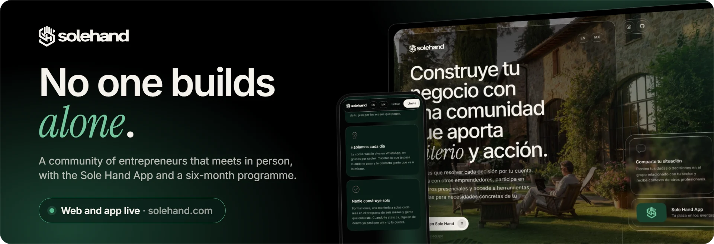
</p>

<p align="center">
  <a href="https://solehand.com"><b>solehand.com</b></a> ·
  <a href="https://app.solehand.com">app.solehand.com</a> ·
  <a href="#build-progress">Progress</a> ·
  <a href="#architecture">Architecture</a> ·
  <a href="#security">Security</a>
</p>

<p align="center">
  
  
  
  
  
  
  
  
  
  
  
</p>

# Sole Hand

Sole Hand is a community of entrepreneurs: people who already run a business and people who want to start one. We find what is holding each business back and solve it, with the tools needed to build well, fast and profitably. We meet in person, and whoever recommends the community gets paid for it.

Around the community there is a public website in three locales; the Sole Hand App, where members book their seat at the events, manage their account and group, and where people who recommend have their own portal; Sole Hand Scale, a six-month programme for people starting out in which AI tools are built for each business; and an in-house pipeline for the social content.

I designed and built all of it from scratch as a full-stack developer: the website and the app, the self-hosted backend and its data model, the payments, the security hardening, the lead service, the deployment and the image and video pipeline. The website and the app have been live since August 2026. Card payments are built and tested end to end, and membership sales open when the security programme below closes.

## Build progress

<picture>
  <source media="(prefers-color-scheme: dark)" srcset="docs/progress/progress-dark.svg">
  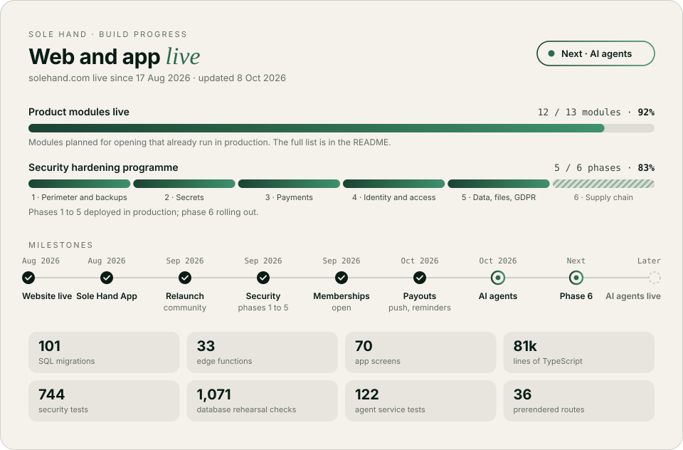
</picture>

<!-- progress:start -->
_Last updated 29 Sep 2026 · solehand.com live since 17 Aug 2026._

| Track | Progress | |
|---|---|---|
| Product modules live | 10 / 12 modules | **83%** |
| Security hardening programme | 5 / 6 phases | **83%** |

<details>
<summary>The 12 modules behind the first bar</summary>

| Module | Status | What it covers |
|---|---|---|
| Website in three locales | Live | solehand.com in Spanish, English and a Mexican variant, prerendered, with build guards on copy, prices and contrast. |
| Public brand manual | Live | solehand.com/marca, generated from the same design tokens the website paints with. |
| Lead service | Live | The contact form lands in its own Node service, separate from the website. |
| Accounts and sign-up | Live | Open sign-up as a member or as someone who recommends, confirmed through the inbox. |
| Member directory | Live | People and businesses of the community, with visibility decided by the database. |
| Events and seat booking | Live | Event cards and first-come seat booking from the Sole Hand App. |
| Sole Hand Scale area | Live | Programme panel and sessions for people in the six-month programme. |
| Recommend-and-earn portal | Live | Link, QR code, materials, referrals and commissions for people who recommend the community. |
| Admin panel | Live | Members, businesses, events, sign-ups, payouts, the audit trail and GDPR erasure. |
| Content pipeline | Live | Social images and video rendered from HTML with the brand's own fonts and tokens. |
| Card payments | Built, not switched on | Checkout, customer portal, 14-day withdrawal and payouts, built and tested end to end in Stripe's test mode. Switched on when the security programme closes. |
| Tailored AI tools | Planned | Built inside Sole Hand Scale for each business, starting from the problem it brings. |

</details>
<!-- progress:end -->

The card and the tables in this README come from [`roadmap.json`](roadmap.json). When a milestone lands I edit that file and run [`tools/progress.mjs`](tools/progress.mjs), which redraws the card and rewrites these sections. The figures on the card are counted in the private repositories: SQL migration files, edge functions (shared code excluded), screens wired into the app router, lines of TypeScript across the app, the functions and the website, tests in the security suite, passing checks in the database rehearsal, and the routes the website prerenders.

## What it is

| Piece | What it does |
|---|---|
| The community | People who have run a business for years and people building their first one, in the same place. The conversation lives in WhatsApp groups by sector, and meetups are included in every membership. |
| Events | Events, workshops, networking dinners and retreats. Each one is published from a single typed content file, so a card without its date, its place or the memberships that include it does not compile. Seats are booked from the app, first come, first served. |
| Sole Hand App | The community on the phone: the seat at each event, the account and the group, and the portal for people who recommend. An installable web app. |
| Sole Hand Scale | The six-month programme for people starting out: a small group, a weekly group session, a monthly mastermind and one-to-one, and the events of the semester. AI tools are built here for each business: problem first, tool second. |
| Recommend and earn | Recommending is free, needs no membership and pays only on memberships that are paid for and used. The rules are written down and visible. |
| Website | Spanish, English and a Mexican variant, each with its own URL, metadata and structured data generated at build time, fully prerendered for crawlers that do not run JavaScript. |
| Admin | Members, businesses, events, sign-ups, payouts, the audit trail and GDPR erasure, behind the same database rules as everything else. |

## Screenshots

Taken from the live website, which is Spanish first.

<table>
  <tr>
    <td width="50%" valign="top"><br><sub><b>Home.</b> The community first: in-person meetings, tools shaped to each business and clear conditions.</sub></td>
    <td width="50%" valign="top"><br><sub><b>English.</b> Every locale has its own URL, metadata and structured data, generated at build time.</sub></td>
  </tr>
  <tr>
    <td width="50%" valign="top"><br><sub><b>The community.</b> We meet in person, we talk every day and nobody builds alone.</sub></td>
    <td width="50%" valign="top">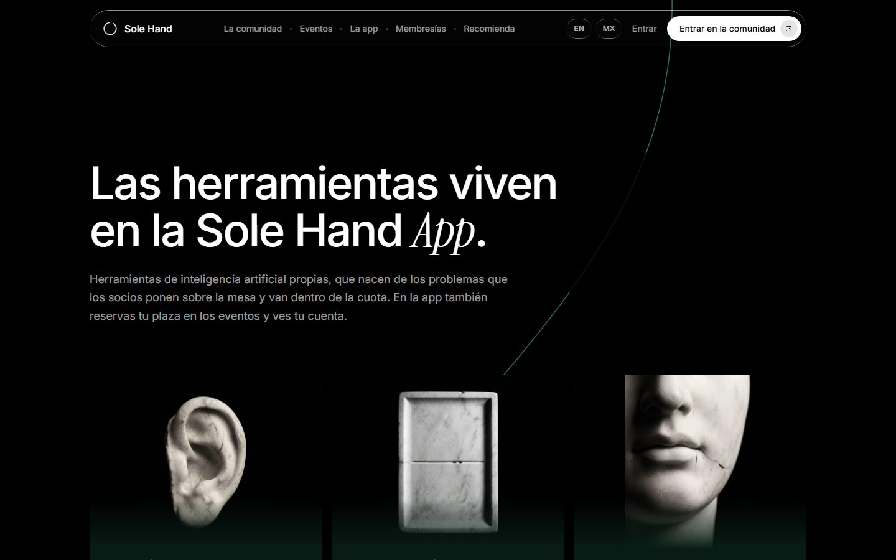<br><sub><b>The Sole Hand App.</b> Seats at the events, account and groups, the space for people who recommend and AI tools built for each business.</sub></td>
  </tr>
  <tr>
    <td width="50%" valign="top">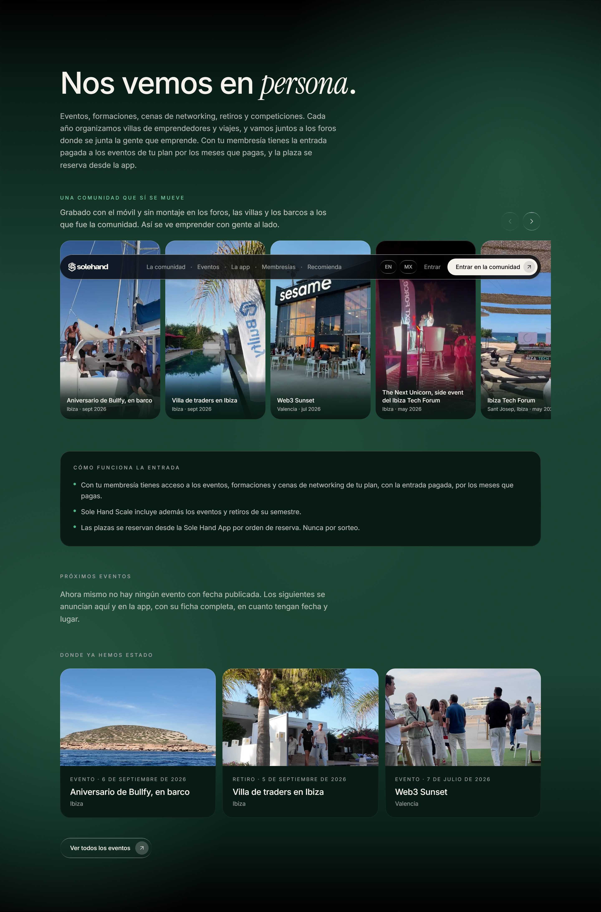<br><sub><b>Events.</b> A reel of clips recorded on a phone at the meetups, how the ticket works, and where the community has been.</sub></td>
    <td width="50%" valign="top"> 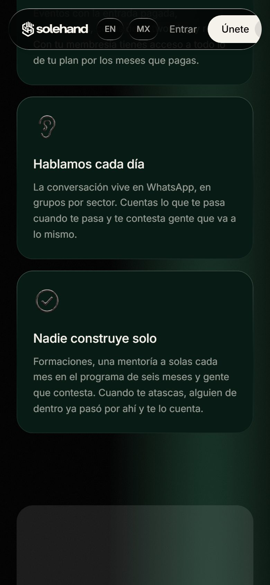<br><sub><b>On the phone.</b> The mobile layout was measured screen by screen with a script that counts how much pure black each one shows; the green halos came out of those numbers.</sub></td>
  </tr>
  <tr>
    <td width="50%" valign="top">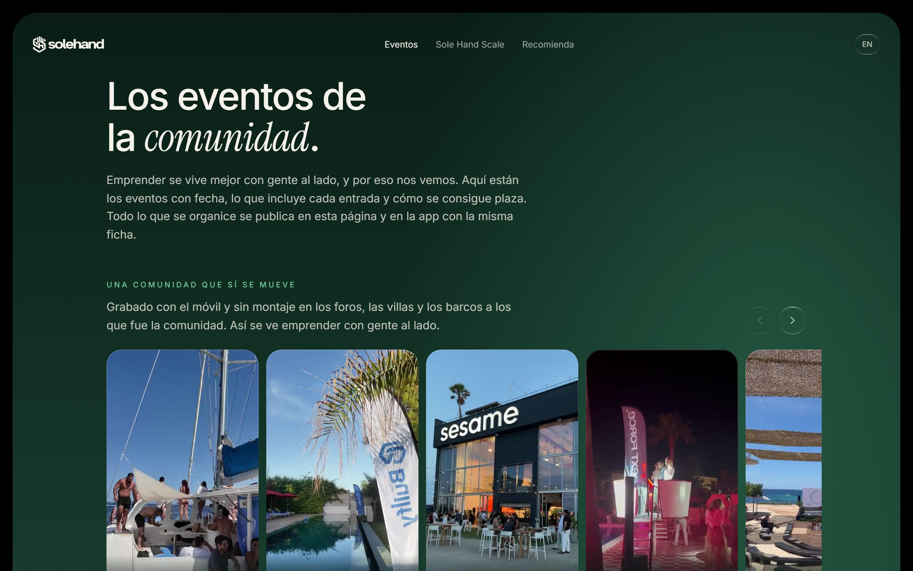<br><sub><b>The events page.</b> Every event is published with the same card here and in the app.</sub></td>
    <td width="50%" valign="top">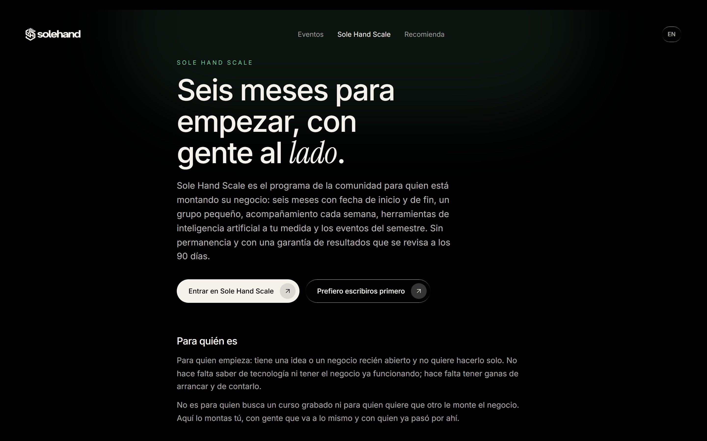<br><sub><b>Sole Hand Scale.</b> Six months with a start and an end date, a small group and people alongside.</sub></td>
  </tr>
  <tr>
    <td width="50%" valign="top">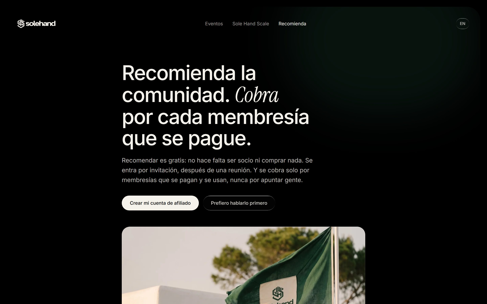<br><sub><b>Recommend and earn.</b> Free to join, and paid only on memberships that are paid for and used.</sub></td>
    <td width="50%" valign="top">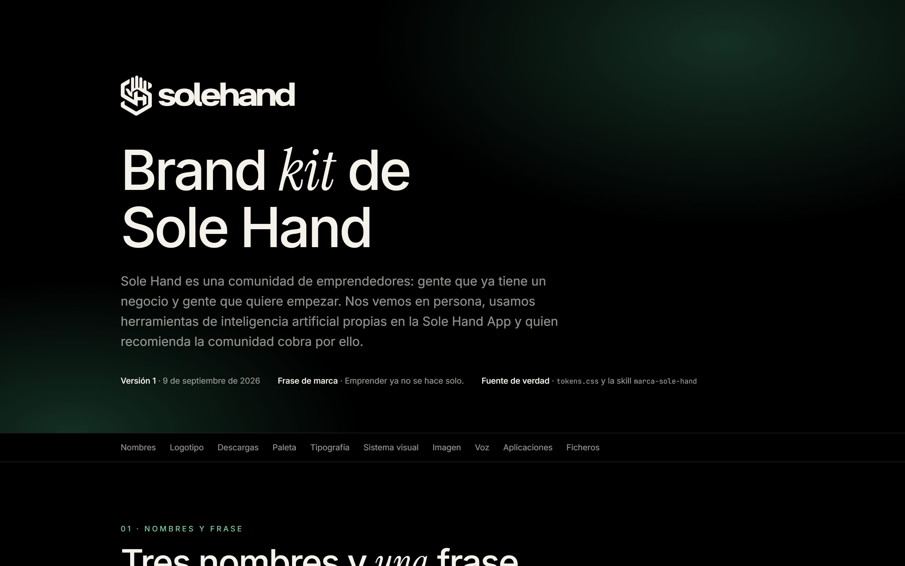<br><sub><b>Brand manual.</b> Public at <a href="https://solehand.com/marca">solehand.com/marca</a>, generated from the same tokens the website paints with.</sub></td>
  </tr>
</table>

### Content pipeline

The social pieces come out of a composition system of my own. The text of each piece lives in a JSON script with the source of every figure, a validator rejects anything that contradicts the brand rules or an amount typed by hand, and the browser renders each slide at native size with the real fonts and logo. Video follows the same idea: local transcription, an animated graphic layer rendered frame by frame from HTML, and a final composition that leaves the camera footage untouched.

<p align="center">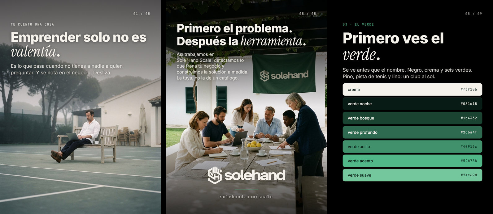</p>
<p align="center">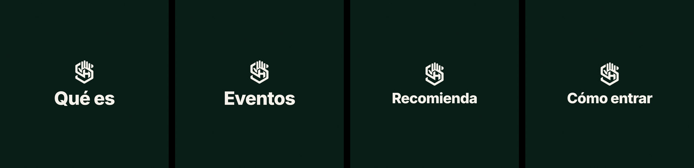</p>

## Stack

| Layer | Choice |
|---|---|
| Website | React 18, Vite 8 and TypeScript, Tailwind CSS 4, GSAP and Lenis for motion. No router library: regex routing and one URL per locale generated at build time |
| Prerender and SEO | Playwright renders 36 routes to static HTML at build time, with canonical, hreflang, sitemap and JSON-LD per locale |
| App | React 18, React Router 7, Vite 8, TypeScript in strict mode and Tailwind CSS 4, shipped as an installable web app with 59 screens |
| Backend | Self-hosted Supabase in Europe: PostgreSQL 17 with row-level security, auth, file storage and an API gateway |
| Data | 90 SQL migrations, each one rehearsed in an in-memory PostgreSQL (PGlite) before it reaches production; most recent ones ship with an undo script |
| Server logic | 27 edge functions in TypeScript on Deno, with their client library pinned to an exact version |
| Payments | Stripe Checkout, customer portal and signed webhooks, and Stripe Connect for payouts to people who recommend |
| Leads | A small Node 24 service with Nodemailer, in its own container |
| Delivery | Docker images pinned by digest, a reverse proxy with rate limits in front, and nginx serving the static builds |
| Testing | A `node:test` security suite, the database rehearsal, end-to-end batteries and a Playwright audit of every app screen on a phone viewport |
| Content | HTML scenes rendered with Playwright and GSAP, ffmpeg for composition and whisper.cpp for local transcription |

## Architecture

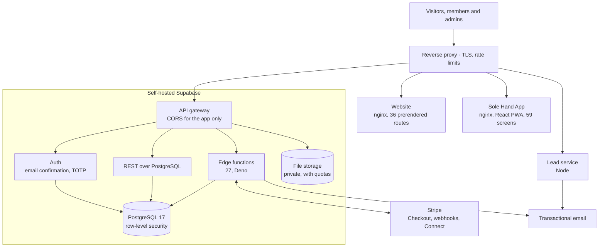

Everything runs as Docker containers on a VPS in Europe; payments go through Stripe and email through an SMTP provider.

A few decisions explain most of the code. The long version is in [docs/architecture.md](docs/architecture.md).

The database is the only authority. Row-level policies decide what a member can read, what the team can read and what nobody can read, in the engine and not in the code that paints the screen. A badly written screen can show too little; it cannot show too much. Operations that need privilege run in edge functions, and the key that carries that privilege never reaches the browser.

Migrations are rehearsed before production sees them. Every migration runs first against a PostgreSQL 17 that lives inside the test process, with a Supabase scaffold on top, and recent ones carry a behaviour test for their policies, grants and edge cases: 806 checks today, and the CI pipeline runs them all.

Payments follow Stripe, not the event. The webhook applies the state Stripe holds at that moment instead of the payload it received, so retries and out-of-order deliveries end in the same place. Before opening a checkout the backend asks Stripe whether that business already has a subscription.

Consent is stored whole. Accepting the terms stores the version, the full text of that version and the time. Changing the text forces a new version, so the history is never rewritten and it is always possible to know exactly what each person accepted.

Erasure is real. Deleting an account removes the person's data across tables and files; what the law requires to keep, such as the tax records of a payout, stays for its legal period and then goes. Each erasure is recorded, so it is applied again if an older backup is ever restored.

The website checks itself. Every build runs four audits (copy against the brand rules, prices against what the app actually charges, colour contrast and the locale overrides) and then prerenders every route. If an audit fails, nothing ships.

The lead service stands apart. The contact form lands in its own container, so if it goes down the website stays up and the form falls back to WhatsApp.

The AI tools built inside Sole Hand Scale share one boundary: they collect and hand over, and a person decides. They introduce themselves as assistants, as Article 50 of the EU AI Act requires, data is processed in Europe, and each business signs a processing agreement under Article 28 of the GDPR.

## Security

Sole Hand holds members' accounts, business details and payment records, so I treat security as part of the product. In September 2026 I audited the whole platform (code, database, infrastructure and secrets) and turned the result into a six-phase hardening programme. Phases 1 to 5 are deployed in production and phase 6 is rolling out. Card payments are built and tested, and membership sales open when the programme closes.

<!-- phases:start -->
| Phase | Scope | Status | What it puts in place |
|---|---|---|---|
| 1 | Perimeter and backups | Deployed | Admin consoles off the public internet, a second factor on every operator account, encrypted off-site backups with a restore tested row by row, and access logging at the proxy. |
| 2 | Secrets | Deployed | Every key rotated, an encrypted secrets manager as the only source, nothing exported in clear, and SSH closed to the internet and key-only. |
| 3 | Payments | Deployed | Signed webhooks that apply the state Stripe holds now, a pinned API version with timeouts, one subscription per business, withdrawal receipts and a watchdog that emails the team when anything about money goes wrong. |
| 4 | Identity and access | Deployed | No session before the email is confirmed, suspension that cuts sessions across API, storage and functions, rate limits at the proxy, CORS locked to the app and a TOTP second factor for administrators. |
| 5 | Data, files and GDPR | Deployed | An immutable, minimised audit trail, private file storage with quotas and short-lived links, full GDPR erasure and retention periods purged every night. |
| 6 | Supply chain and staging | Rolling out | CI on every push with actions pinned by SHA and secret scanning, deployments gated on green CI, a separate staging stack, images pinned by digest and event-booking hardening. |
<!-- phases:end -->

The controls, area by area:

- **The database decides access.** Row-level security covers the data and the file storage. Suspending an account ends its sessions, and its token stops working on the API, the storage and the functions at once.
- **Identity.** No session exists before the email is confirmed, and the password is set from the confirmation link. Sign-up never reveals whether an account exists, and tokens are short-lived. The admin role is built on a TOTP second factor, with a fresh code for payouts, GDPR erasure and role changes, and every operator account behind the platform (hosting, deployment, code and payments) has two-factor authentication.
- **The edge.** Rate limits at the reverse proxy for sign-in and public functions, authentication endpoints the app does not use closed at the proxy, CORS limited to the app's own origin, a cap on request size, and hand-set security headers on the website.
- **Secrets.** One encrypted secrets manager is the only source. Every key has been rotated, nothing is exported in clear, scripts receive secrets at run time, and any script that writes to production refuses to run without an explicit flag.
- **Servers.** SSH is closed to the internet: reachable only over a private network, only with keys, and with brute-force banning. Database consoles are not reachable from outside.
- **Backups.** Full encrypted backups live away from the server and from the workstation, and restores are tested row by row in an isolated database with no network.
- **Audit trail.** Immutable: not even the service role can update, delete or truncate it. Minimised: no IP addresses and no emails, only keyed fingerprints. Changes of privilege are logged too.
- **GDPR.** Erasure works end to end across tables and files, retention periods are purged every night, and the data is processed in Europe.
- **Payments.** Signed webhooks, a pinned API version, timeouts on every call, one subscription per business, withdrawal receipts, and a watchdog that emails the team when anything about money goes wrong, without personal data in the message.
- **Supply chain.** CI on every push with a read-only token, actions pinned to a full commit SHA, secret scanning over the whole history and a dependency audit. Production deploys need a clean tree, a pushed commit and green CI. Container images are pinned by digest, function dependencies by exact version, and a separate staging stack keeps end-to-end tests away from production.

The production source stays private. It is a live system with personal and payment data, and publishing all of it would hand out its attack surface.

## Quality

- **Security suite.** 469 tests with `node:test` over the function contracts, checkout, webhooks and their signatures, authorisation, sign-up, GDPR, the audit trail, events, secrets handling, CI and the guards on production scripts.
- **Database rehearsal.** Every migration and its behaviour tests run against an in-memory PostgreSQL 17: 806 passing checks, and the CI pipeline runs the whole rehearsal.
- **End to end.** Batteries for the access matrix, sign-up over the internet, Stripe webhooks in test mode, GDPR erasure, file storage, rate limits and concurrent seat booking.
- **Build guards.** The website runs its four audits, the prerender and a locale test on every build. The app runs style, contrast, price and translation checks, email previews and a strict mobile audit that walks every screen in a real browser looking for overflow, console errors and touch targets too small for a finger.
- **Types.** TypeScript in strict mode and oxlint across both front ends.

## Roadmap

<!-- roadmap:start -->
| When | Milestone | Status | What shipped, or what comes next |
|---|---|---|---|
| Aug 2026 | Website live | Done | solehand.com live in Spanish and English on 17 August: a static React build in Docker behind nginx with hand-set security headers, and a separate lead service for the contact form. |
| Aug 2026 | Sole Hand App | Done | Self-hosted Supabase backend with row-level security, accounts with open sign-up, member directory, events, the recommend-and-earn portal and the admin panel. |
| Sep 2026 | Relaunch · community | Done | Sole Hand redefined as a community of entrepreneurs: new identity and public brand manual, a Mexican variant of the site, event and Sole Hand Scale pages, build guards and the content pipeline. |
| Sep 2026 | Security · phases 1 to 5 | Done | Full security audit of the platform, turned into a six-phase programme. Deployed: perimeter and backups, secrets, payments, identity and access, data, files and GDPR. |
| Next | Phase 6 | In progress | Supply chain and staging: CI with pinned actions and secret scanning, a separate staging stack, images pinned by digest and event-booking hardening. |
| Later | Memberships open | Planned | Card payments switched on once the programme closes, and the first AI tools built inside Sole Hand Scale for each business. |
<!-- roadmap:end -->

The dated log of the build is in [docs/build-log.md](docs/build-log.md).

## Repository layout

```
docs/          banner, progress cards, architecture notes and the build log
media/         screenshots of the live website and the social content
recursos/      free resources for Spanish-speaking founders, once they exist
roadmap.json   modules, phases, milestones and stats: the source for the card above
tools/         script that draws the progress card and updates this README
```

---

Designed and built by **Daniel Brosed**, full-stack developer and security auditor.
[danielbrosed.com](https://danielbrosed.com) · [LinkedIn](https://www.linkedin.com/in/danielbrosed/)

This repository is a portfolio case study. The production code is private and the screenshots come from the live website. © 2026 Daniel Brosed.
