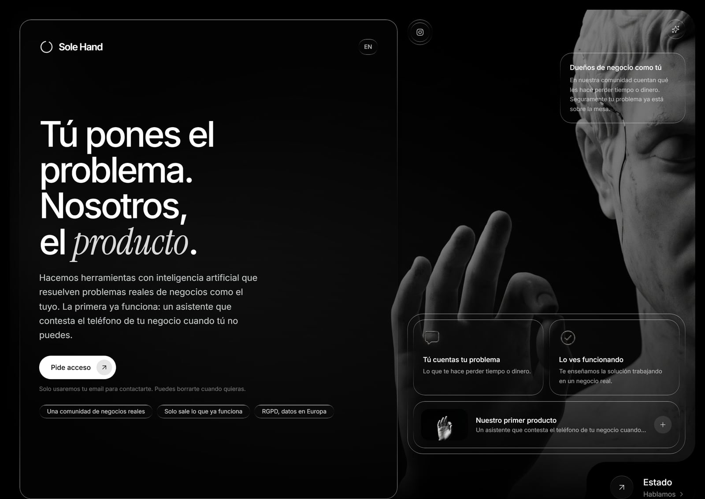
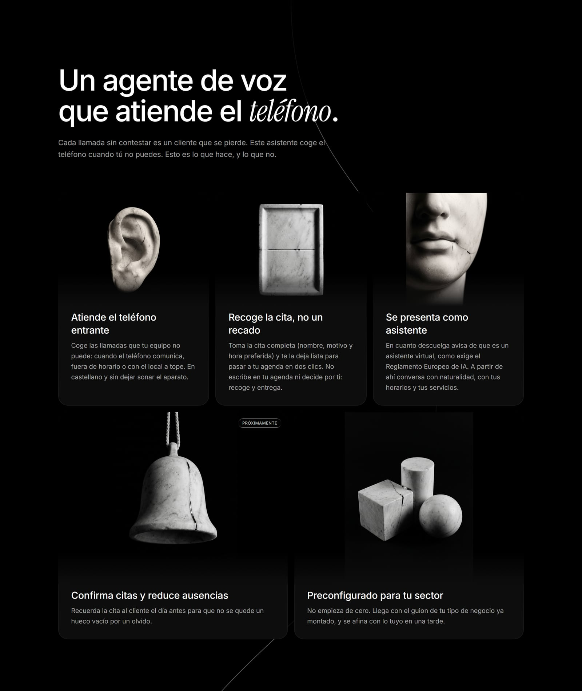
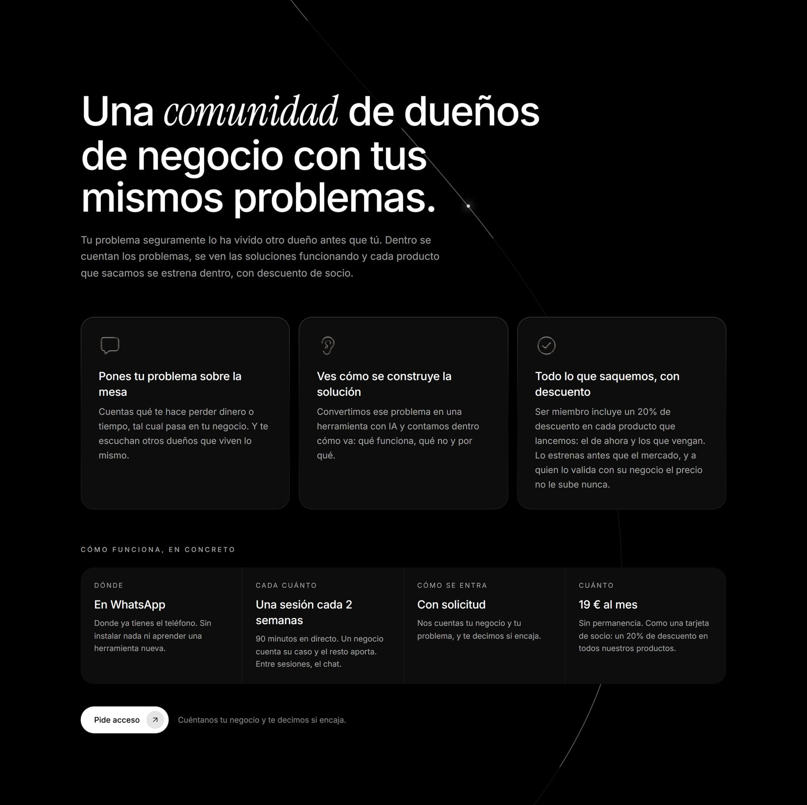
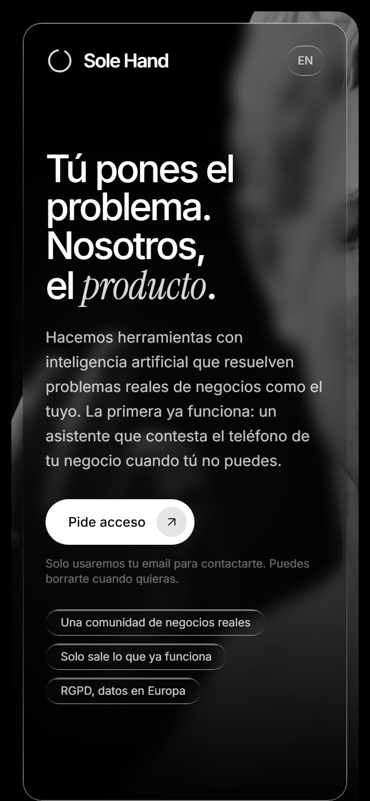
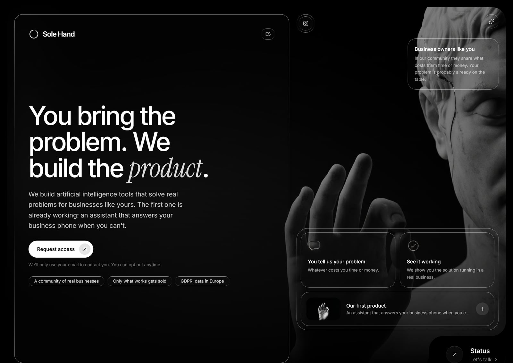
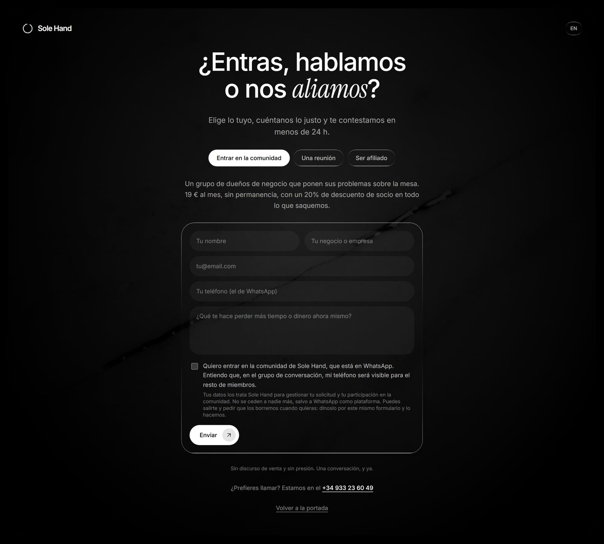
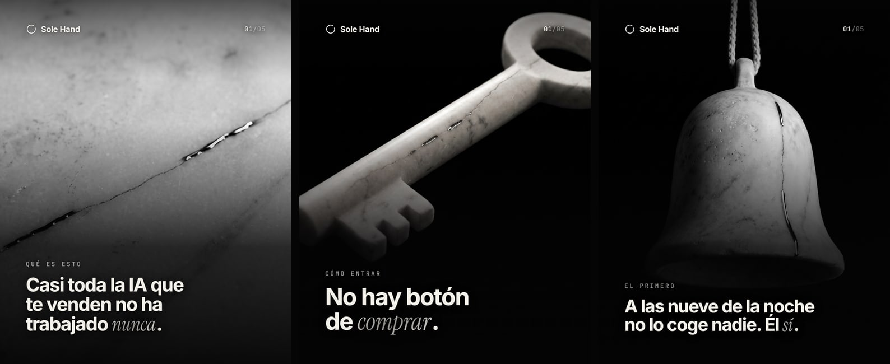

  

<h3 align="center">Tú pones el problema. Nosotros, el producto.</h3>

  <a href="https://solehand.com">solehand.com</a> · español / english

---

Sole Hand es una agencia de inteligencia artificial para negocios en España, construida con una regla simple: **no se vende nada que no esté ya funcionando en un negocio real**.

Este repositorio es el escaparate público del proyecto: qué se está construyendo, en qué estado está y cómo está hecho por dentro, a nivel de arquitectura. El código de producción vive en repositorios privados.

## Qué hay construido

### El agente de voz

El primer producto. Un asistente que atiende el teléfono entrante de un negocio cuando su equipo no puede: fuera de horario, cuando comunica o cuando entran varias llamadas a la vez.

| Hace | No hace |
| --- | --- |
| Contesta en castellano, sin dejar sonar el teléfono | No decide por el negocio |
| Recoge la cita completa: nombre, motivo y hora preferida | No escribe directamente en la agenda |
| Se presenta como asistente virtual nada más descolgar | No se hace pasar por una persona |
| Deja un resumen claro de cada llamada | No obliga a escuchar grabaciones |

La frontera está puesta a propósito: el agente recoge y entrega, y la última palabra siempre es de una persona. De ahí el nombre del proyecto.

### La comunidad

Un grupo privado de dueños de negocio, en WhatsApp, donde cada uno pone sobre la mesa lo que le hace perder tiempo o dinero. Cada dos semanas hay una sesión en directo de 90 minutos: un negocio cuenta su caso y el resto aporta. Dentro se ven las soluciones funcionando antes que nadie.

Los datos que ya son públicos en la web: 19 € al mes, sin permanencia, con un 20 % de descuento de socio en cada producto que se lance. Se entra con solicitud: el negocio cuenta su caso y se le responde en menos de 24 horas.

### La web

Bilingüe español / inglés: cada idioma tiene su URL propia, generada en build con su título, sus metadatos y sus datos estructurados, y las dos versiones se declaran mutuamente con hreflang. Diseño propio sobre una dirección de arte de mármol y cromo, con animación medida y una regla de copy que se aplica a todo el proyecto: lo tiene que entender un niño de 5 años y un abuelo de 80.

| Móvil | Inglés | La página /hablamos |
| --- | --- | --- |
|  |  |  |

## Estado del proyecto

Actualizado a 19 de agosto de 2026.

| Módulo | Estado | Progreso |
| --- | --- | --- |
| Web pública bilingüe | En producción en solehand.com | `█████████░` 92 % |
| Servicio de captación de leads | En producción | `█████████░` 88 % |
| Comunidad | Abierta, alta con solicitud | `████████░░` 75 % |
| Agente de voz v1 | En piloto | `██████░░░░` 55 % |
| Contenido y marca en redes | En curso | `██████░░░░` 65 % |
| Panel del cliente | Definición cerrada, prototipo inicial | `███░░░░░░░` 25 % |
| Programa de afiliados | En diseño | `██░░░░░░░░` 15 % |
| Confirmación de citas | En diseño | `█░░░░░░░░░` 10 % |

La bitácora completa, con los hitos fechados, está en [docs/bitacora.md](docs/bitacora.md).

## Cómo está hecho

Resumen rápido; el detalle está en [docs/arquitectura.md](docs/arquitectura.md).

- **Frontend:** React 18 + Vite + TypeScript, Tailwind CSS 4 y GSAP para el movimiento. Sin router: la web es una pieza única con anclas, y en build se genera una URL propia por idioma con sus metadatos y su hreflang.
- **Leads:** servicio propio en Node, separado de la web, que recibe el formulario, avisa al equipo y responde al interesado. Sin plataformas de marketing por medio: los detalles del interesado viajan solo por el correo de la empresa.
- **Infraestructura:** contenedores Docker detrás de nginx en un VPS propio, con cabeceras de seguridad configuradas a mano y HTML sin caché para que los cambios se vean al instante.
- **Cumplimiento desde el diseño:** el agente se presenta como asistente virtual al descolgar, como exige el artículo 50 del Reglamento Europeo de IA, y está diseñado para que los datos se procesen en infraestructura europea. La web no usa cookies de rastreo.

## Dirección de arte

Toda la marca vive en un mismo mundo: mármol de Carrara, cromo y negro. El símbolo es un enso, un círculo abierto: la inteligencia artificial hace el trabajo y una mano humana, la última, decide. Las piezas para redes se componen con un sistema propio que garantiza que cada publicación sale del mismo molde.

## Contacto

El proyecto se puede ver funcionando en [solehand.com](https://solehand.com). Para hablar del proyecto, el formulario de [solehand.com/hablamos](https://solehand.com/hablamos).

---

© 2026 Daniel Brosed. Este repositorio es material de portfolio; el código de producción no es público.
